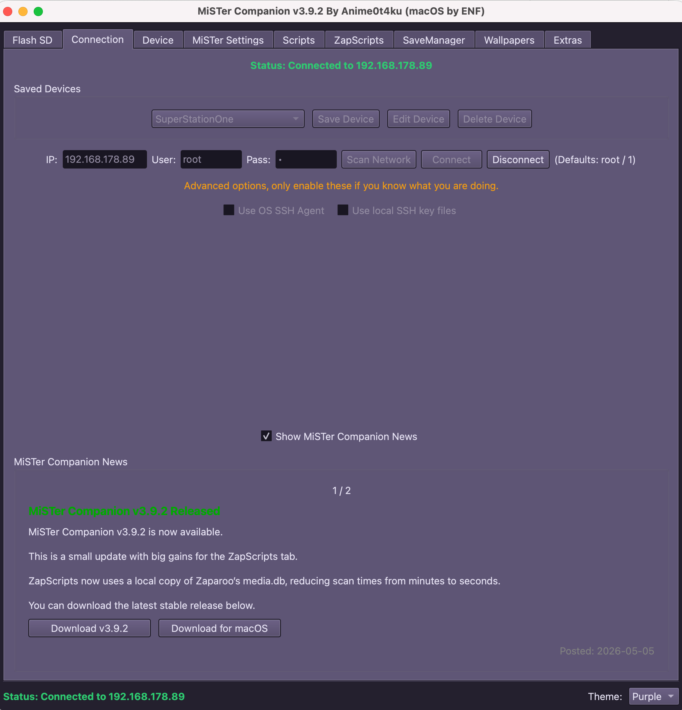

# MiSTer Companion — macOS Port

> **Original author:** [Anime0t4ku](https://github.com/Anime0t4ku) · upstream project: [Anime0t4ku/mister-companion](https://github.com/Anime0t4ku/mister-companion)

A macOS build of MiSTer Companion, the cross-platform GUI utility for managing and maintaining a MiSTer FPGA system over SSH.

This port provides a native `.app` bundle and DMG installer for Apple Silicon Macs, with macOS-specific adjustments for user-data locations, terminology, and file-sharing integration.

---

## Download

| Platform | File | Link |
|---|---|---|
| macOS (Apple Silicon, arm64) | `MiSTer Companion-3.5.1.dmg` | **[Download v3.5.1](https://github.com/ENFStudios/mister-companion-macos/releases/download/v3.5.1/MiSTer.Companion-3.5.1.dmg)** |

Latest releases: [github.com/ENFStudios/mister-companion-macos/releases](https://github.com/ENFStudios/mister-companion-macos/releases)

---

---

## System Requirements

- **Apple Silicon Mac** (M1 / M2 / M3 / M4 or newer) — arm64 only. No Intel (x86_64) build is provided.
- **macOS 11 Big Sur** or later.
- A MiSTer FPGA reachable over the local network via SSH.

---

## Installation (DMG)

1. Download `MiSTer Companion-<version>.dmg` from the Releases page.
2. Open the DMG. A window opens showing the app icon and an `Applications` shortcut — drag **MiSTer Companion** onto `Applications`.
3. Eject the DMG.

### First Launch — Gatekeeper Warning

Because this build is not signed with a paid Apple Developer ID, macOS Gatekeeper will block the first launch. The dialog you see depends on your macOS version — on **macOS 15 Sequoia and newer** the dialog only offers **Done** and **Move to Bin**; there is no longer an "Open Anyway" button in the dialog itself, and the Control-click → Open workaround has also been removed by Apple.

To approve the app, use **System Settings**:

1. Double-click **MiSTer Companion** once so macOS registers it as blocked, then dismiss the warning.
2. Open **System Settings → Privacy & Security**.
3. Scroll to the bottom — you should see a message like *"MiSTer Companion" was blocked to protect your Mac.*
4. Click **Open Anyway** and authenticate with Touch ID or your password.
5. The next time you launch the app, confirm **Open** in the final dialog.

From then on you can start it normally via double-click, Dock, or Spotlight.

> **On macOS 14 Sonoma and earlier:** right-clicking (or Ctrl-clicking) the app in Finder and choosing **Open** also works. This shortcut was removed in Sequoia.

### Why the warning?

The DMG is built with an **ad-hoc code signature** only — there is no paid Apple Developer ID behind it, and the app is not notarized. macOS therefore requires a one-time manual override. This is expected behavior for community builds; the app binary itself is unmodified.

### Where user data is stored

After a DMG install, all user data is stored under:

    ~/Library/Application Support/MiSTer Companion/

The layout is:

    ~/Library/Application Support/MiSTer Companion/
    ├── config.json                  # saved devices, last selected device, preferences
    ├── MiSTerSettings/              # MiSTer.ini backups (created by the MiSTer Settings tab)
    │   └── <device-name>/
    │       └── MiSTer-<timestamp>.ini
    └── SaveManager/                 # everything related to the SaveManager tab
        ├── backups/                 # timestamped save backups per device
        │   └── <device-name>/
        │       └── <timestamp>/
        │           ├── saves/
        │           └── savestates/  # optional
        └── sync/                    # Local Sync Folder — merged newest saves across devices

Notes:
- `config.json` holds your saved SSH device profiles (IP, user, password) — back it up if you want to keep your device list portable.
- To reveal the folder in Finder, open Finder → **Go → Go to Folder…** and paste `~/Library/Application Support/MiSTer Companion/`.
- If you previously ran the app from source and accumulated data in `MiSTerSettings/` and `SaveManager/` next to the repo, it is migrated into this folder automatically on first launch of the bundled build.

---

## Running From Source

Requirements:

- Python 3.10 or newer (tested up to 3.14)
- PyQt6, paramiko, requests, websocket-client, psutil

All dependencies install as prebuilt arm64 wheels, so you normally **do not** need Xcode Command Line Tools. If pip falls back to building a package from source, run `xcode-select --install` once and retry.

Set up a virtualenv and install dependencies:

    python3 -m venv .venv
    source .venv/bin/activate
    pip install -r requirements.txt

For a fully reproducible install (pinned versions matching the DMG build), use the lock file instead:

    pip install -r requirements-lock.txt

Run:

    python main.py

In source mode, user data is stored next to the repository (`./MiSTerSettings`, `./SaveManager`) instead of in `~/Library/Application Support/`, which is convenient during development.

---

## Building the `.app` and DMG

Additional requirements:

- `py2app` (`pip install py2app`)
- `create-dmg` (`brew install create-dmg`)

Build the bundle:

    source .venv/bin/activate
    rm -rf build dist
    python setup.py py2app

Build the DMG:

    ./build_dmg.sh

The DMG is written to `dist/MiSTer Companion-<version>.dmg`. The build script also cleans stale Launch Services entries left behind by previously mounted DMG volumes, so double-clicking `dist/MiSTer Companion.app` keeps working after multiple builds.

---

## Features

MiSTer Companion uses a tabbed interface to organize functionality.

### Flash SD
- Download the latest Mr. Fusion release directly from within the app
- Download the latest SuperStationONE SD Installer release directly from within the app
- Detect removable drives
- Flash SD cards without external tools
- Hardcoded block for macOS internal boot disks plus type-to-confirm safety

### Connection
- Connect to a MiSTer over SSH
- Save and manage multiple devices
- Scan the local network for MiSTer devices
- Automatic reconnect after a remote reboot

### Device
- View SD card and USB storage usage
- Enable or disable Remote Access (SMB) on the MiSTer
- Open the MiSTer network share directly in Finder
- Reboot the MiSTer remotely

### MiSTer Settings
- Easy Mode for common MiSTer.ini tweaks
- Advanced Mode editor for the full MiSTer.ini
- Automatic backups before applying changes
- Restore from backups or defaults

### Scripts
- Install and configure common MiSTer scripts: `update_all`, `zaparoo`, `migrate_sd`, `cifs_mount` / `cifs_umount`, `auto_time`, `dav_browser`, `ftp_save_sync`, `static_wallpaper`
- Live SSH output while scripts run

### ZapScripts
- Trigger scripts via the Zaparoo Core API: `update_all`, `migrate_sd`, `Insert-Coin`
- Open the Bluetooth or OSD menu, cycle wallpaper, return to the MiSTer home screen
- Launch and Controls are disabled automatically if Zaparoo is not installed

### SaveManager
- Create timestamped backups of MiSTer saves (with optional savestates)
- Per-device retention
- Restore backups to any connected MiSTer
- Sync saves between multiple MiSTer systems
- Local Sync Folder for merging newest save files

### Wallpapers
- Install wallpaper packs via a JSON database system
- Multiple wallpaper sources supported
- Automatic update detection
- Built-in SSH output log

---

## Known Limitations

- **Apple Silicon only.** An Intel build is not provided; building one from source on an Intel Mac is untested.
- **Ad-hoc signed, not notarized.** First launch requires the manual Gatekeeper override described above.
- **No auto-update mechanism.** New versions must be downloaded and installed manually.

---

## Credits

Original author: **[Anime0t4ku](https://github.com/Anime0t4ku)** — see [UPSTREAM_README.md](UPSTREAM_README.md) for the upstream project description.

This repository is a macOS-focused fork/port and is **not** affiliated with or endorsed by the upstream project.

---

## License

GNU General Public License v2.0 (GPL-2.0), matching the upstream project. See [LICENSE](LICENSE) for the full text.
